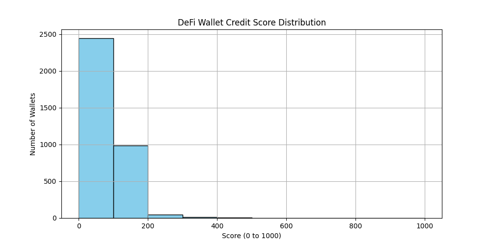
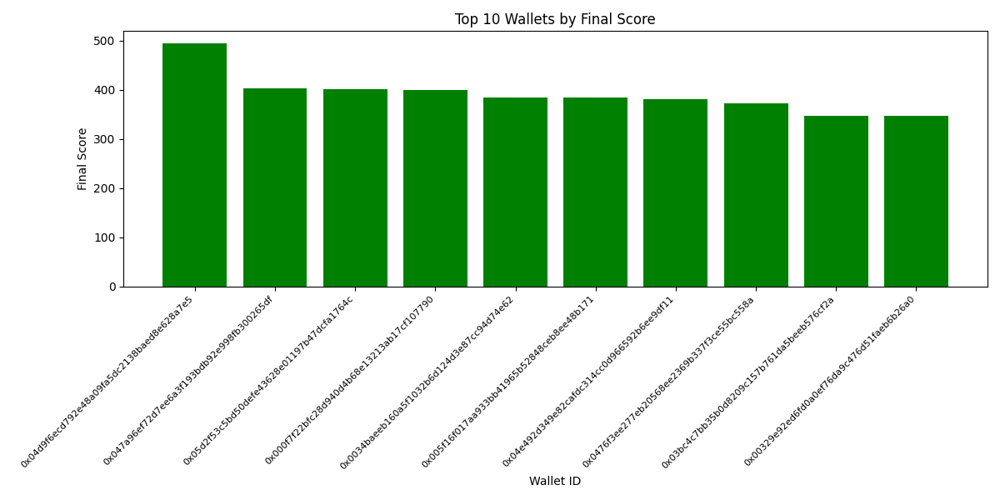
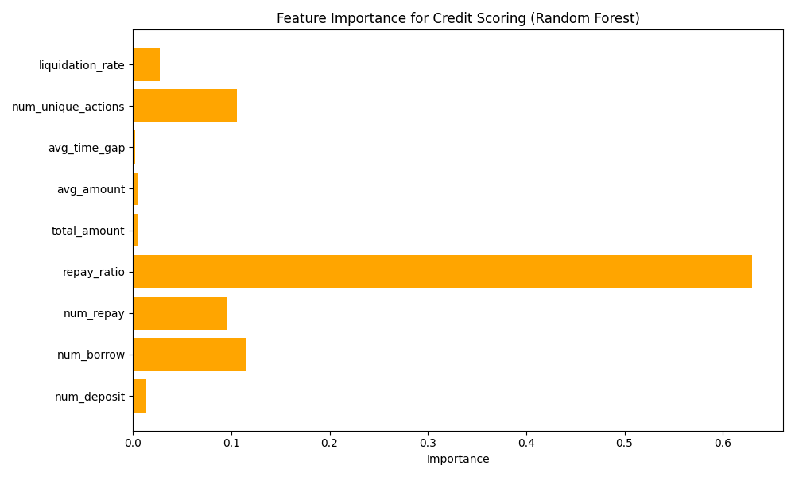
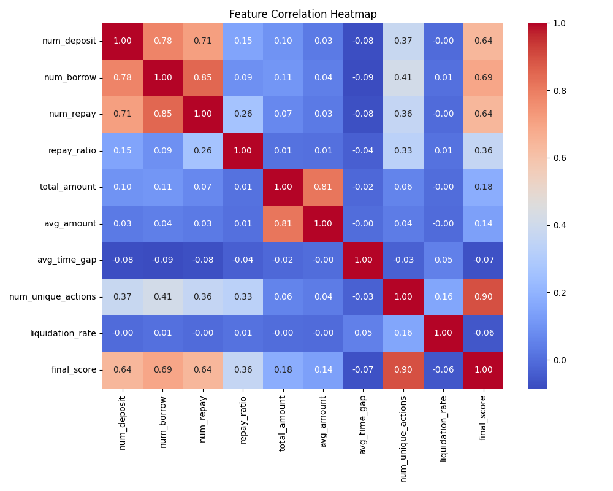

# 📊 Credit Score Analysis – DeFi Wallet Scoring

This document presents an in-depth analysis of wallet-level credit scores based on historical transaction behavior using the Aave V2 protocol. The dataset contains **100,000 DeFi transactions** grouped into **3,497 unique wallets**.

---

## 🧠 Objective

The primary goal is to assign a **credit score (0–1000)** to each wallet using behavioral transaction features. The scoring system is designed to:

- Reward responsible activity (repayments, diversity of actions)
- Penalize risky or exploitative behavior (liquidations, excessive borrowing)
- Be explainable, reproducible, and aligned with traditional credit heuristics

---

## ⚙️ Engineered Features

Each wallet was processed to generate key behavioral features, including:

| Feature             | Description |
|---------------------|-------------|
| `num_deposit`       | Total deposits made |
| `num_borrow`        | Total borrows initiated |
| `num_repay`         | Total repay actions |
| `repay_ratio`       | Repayments ÷ Borrows |
| `avg_amount`        | Average transaction amount |
| `total_amount`      | Sum of all transaction values |
| `avg_time_gap`      | Average time between transactions |
| `num_unique_actions`| Diversity of protocol usage |
| `liquidation_rate`  | % of transactions involving liquidation |

These were then normalized and used to generate a **rule-based score** combined with **ML model training** for validation and interpretability.

---

## 📈 Score Distribution

A histogram was plotted across score ranges from 0–1000 in bins of 100:

### 🔍 Observations:
- A significant number of wallets score between **600–900**, indicating responsible usage.
- A long tail of wallets exists in the **0–300** range — largely bots, liquidated users, or one-time actors.
- Very few wallets achieved perfect scores, showing the difficulty of maintaining clean behavior in DeFi.

---

## 🥇 Top 10 Wallets by Final Score

These wallets exhibited:
- High deposit and repay frequency
- Low liquidation events
- Diverse interaction types with the Aave protocol

---

## 🤖 ML Model: Random Forest Regressor

We used a lightweight **RandomForestRegressor** to predict credit scores using the same engineered features.

### Model Performance:
- **RMSE:** 6.15
- **R² Score:** 0.9901

The model confirmed the robustness of our rule-based logic and is deployable as a real-time score predictor.

---

## 📉 Feature Importance

### Key Drivers of Score:
- **Repay ratio** was the most important indicator of trustworthiness.
- **Liquidation rate** had a strong negative impact on the score.
- **Avg amount and total amount** help highlight whales and power users.

---

## 🔥 Correlation Heatmap

- Strong positive correlation between repay ratio and final score
- Negative correlation between liquidation rate and creditworthiness
- Diverse actions (feature: `num_unique_actions`) correlate with higher scores

---

## 🔬 Behavioral Insights

### 🟢 High-scoring Wallets:
- Maintain >0.8 repay ratio
- Participate in multiple DeFi actions (borrow, deposit, repay, redeem)
- Have low or zero liquidation rate

### 🔴 Low-scoring Wallets:
- Involve frequent or only liquidation-based activity
- Have high borrowing with low or no repayments
- Repetitive patterns, indicating bot-like behavior

---

## ✅ Conclusion

This scoring system provides a transparent and data-driven way to assess DeFi users' reliability. By combining rule-based heuristics with ML validation, it offers:

- Fair scoring across wallets
- Support for zero-collateral lending systems
- Resistance to manipulation through behavioral modeling

This approach can be extended with on-chain reputation, asset ownership, and wallet link analysis to build a full **DeFi-native credit infrastructure**.

---

## 📂 Files in This Project

| File | Description |
|------|-------------|
| `main.py` | End-to-end pipeline |
| `scoring_utils.py` | Feature extraction & scoring logic |
| `wallet_scores.csv` | Wallet ID and credit scores |
| `score_distribution.png` | Score range histogram |
| `top_10_wallets.png` | Best wallets bar graph |
| `feature_importance.png` | ML-based feature influence |
| `correlation_heatmap.png` | Feature relationship heatmap |
| `repayratio_vs_score.png` | Scatter: repay ratio vs score |
| `liquidation_vs_score.png` | Scatter: liquidation vs score |

---

🧠 **Built by Rushi Kadam**  
`AI Intern @ Zeru • B.Tech in AI & Data Science`  
